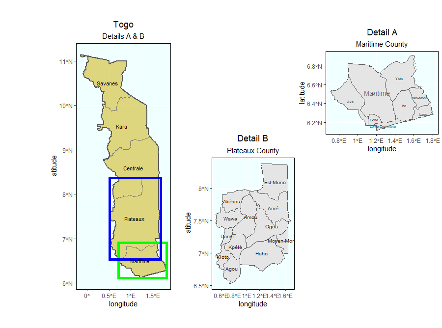
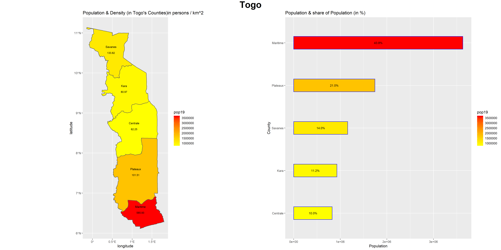
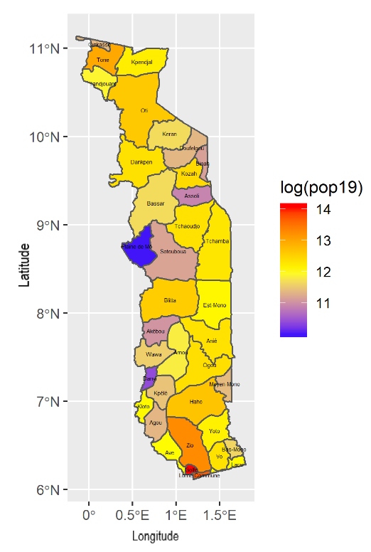
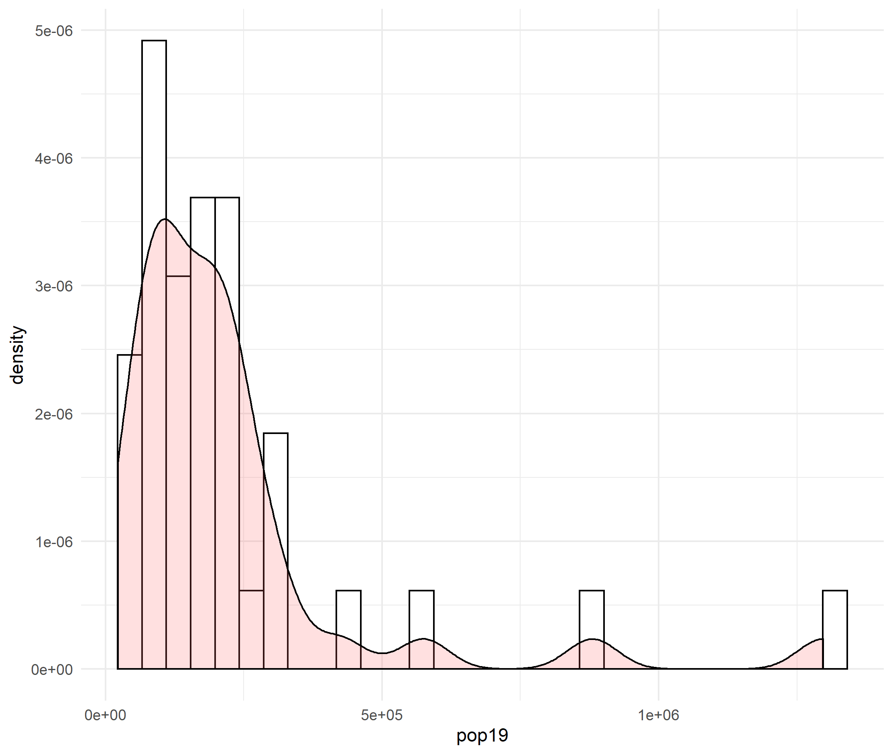

# Togo

Hello! This is my final project on Togo. At first I had chosen Ethiopia as my LMIC. After loading the raster for the simple feature object, however, I noticed that the country is just way too big. I could not find time to run the rasters since I needed my laptop everyday for class. So, enjoy this project on the Western African country, Togo.

## Administrative Subdivisions

There are 5 counties and 37 prefectures in Togo. To the left of the borders resides Ghana and to the right belongs Benin. Bordering the north is Burkina Faso, and the south is the Gulf of Guinea. The capital, Lome, lies in the Southern region of the country as a coastal city in the Maritime County. In the figure, two details are marked A and B. I have chosen the two counties, Maritime and Plateaux, because of their high population. 

## Population of Togo's Counties

As illustrated by the bar plot, the most populated county is Maritime, followed by Plateaux. These counties hold the capital of the country and contain more tourist spots. Overall, these two counties make up 64.8% of the total population. The rest of Togo is used for agriculture and mining. 

## Population of Togo's Prefectures

This figure represents the log of the population of Togo's prefectures. The regions with a red color indicate a higher population while a blue color indicates a lower population with yellow in the middle. For example, Golfe and Lome Commune have a deeper, red color, so they have a higher population. The only prefecture that has a drastically low population is Plaine de Mo. As a whole country, most of the prefectures have a evenly distributed population, shown by the yellow and orange colors, except for the capital.

Below is a rotating, three dimensional plot illustrating the log of the population. The more evelated the prefectures are, the higher the population. 

Here, I have plotted a histogram that relates two subjects: density and the log of population. Although most of the graph is relatively normal, there are a few outliers that extend on the x-axis. I infer that these are regions that contain a large population yet not as dense.

## Regression Model of Togo's Population

