# Togo

Hello! This is my final project on the country, Togo. At first I had chosen Ethiopia as my Lower Middle Income Counry(LMIC). After loading the raster for the simple feature object, however, I noticed that the country is just way too big. I could not find time to run the rasters since I needed my laptop everyday for class. So, enjoy this project on the Western African country, Togo.

## Administrative Subdivisions

There are 5 counties and 37 prefectures in Togo. To the left of the borders resides Ghana and to the right belongs Benin. Bordering the north is Burkina Faso, and the south is the Gulf of Guinea. The capital, Lome, lies in the Southern region of the country as a coastal city in the Maritime County. In the figure, two details are marked A and B. I have chosen the two counties, Maritime and Plateaux, because of their high population. 

## Population of Togo's Counties

As illustrated by the bar plot, the most populated county is Maritime, followed by Plateaux. These counties hold the capital of the country and contain more tourist spots. Overall, these two counties make up 64.8% of the total population. The rest of Togo is used for agriculture and mining. 

## Population of Togo's Prefectures

This figure represents the log of the population of Togo's prefectures. The regions with a red color indicate a higher population while a blue color indicates a lower population with yellow in the middle. For example, Golfe and Lome Commune have a deeper, red color, so they have a higher population. The only prefecture that has a drastically low population is Plaine de Mo. As a whole country, most of the prefectures have a evenly distributed population, shown by the yellow and orange colors, except for the capital.

Below is a rotating, three dimensional plot illustrating the log of the population. The more evelated the prefectures are, the higher the population. 

Here, I have plotted a histogram that relates two subjects: density and the log of population. Although most of the graph is relatively normal, there are a few outliers that extend on the x-axis. I infer that these are regions that contain a large population yet not as dense.

## Regression Model of Togo's Population

Using variables such as dst011, dst040, dst130,...,dst200, topography, slope, and night time lights, I plotted a reggresion model for the 37 prefectures. The model is not terrible, but it is lacking in some areas. For example, on the graph with many data points, a few reside outside of the gray area and way past the line of best fit. But in general, the model predicted most of the data to a certain extent. 

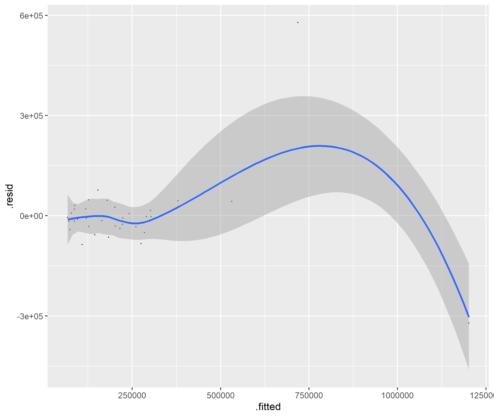
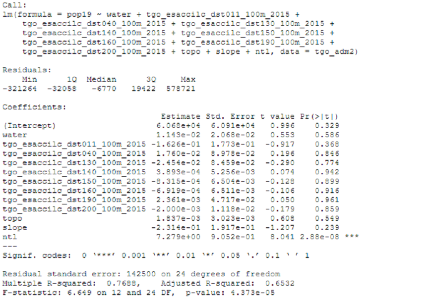

## Population Sums 

##### Population: Predictors- Sums
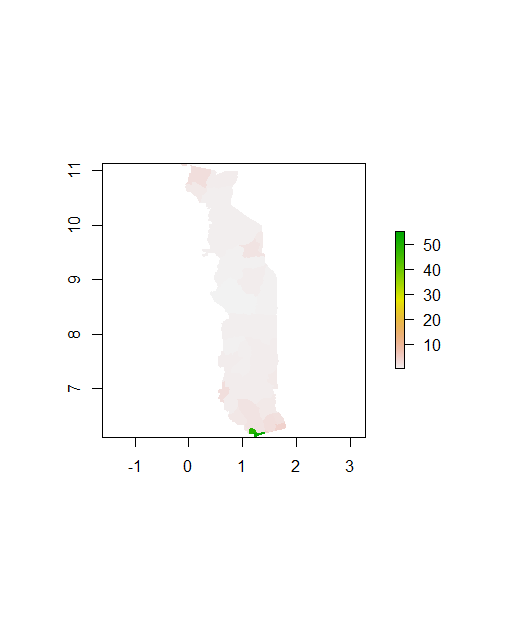
##### Difference: Predictors- Sums
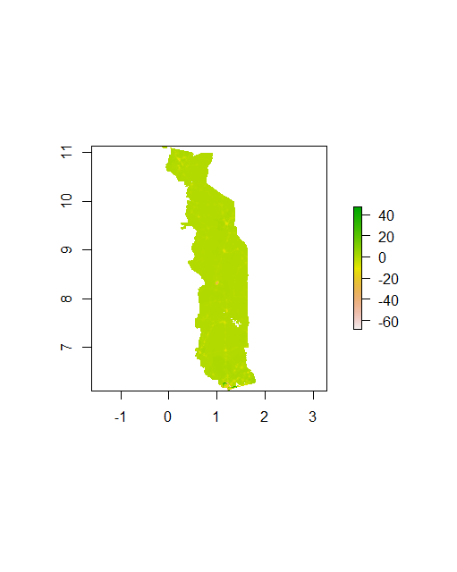
##### 3D Difference: Predictors- Sums
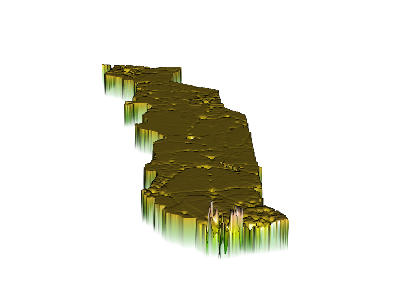

## Population Means

##### Population: Predictors- Means
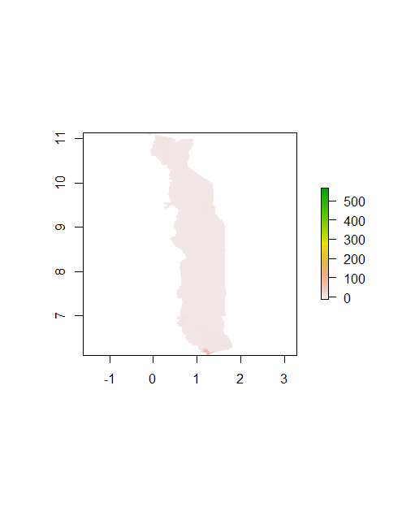
##### Difference: Predictors- Means
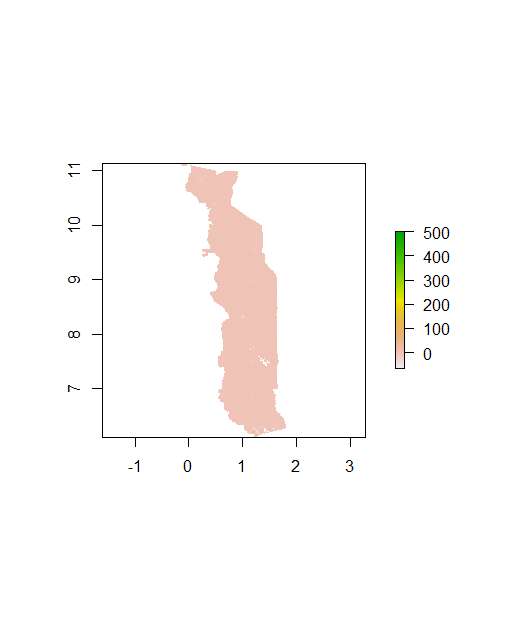
##### 3D Difference: Predictors- Means
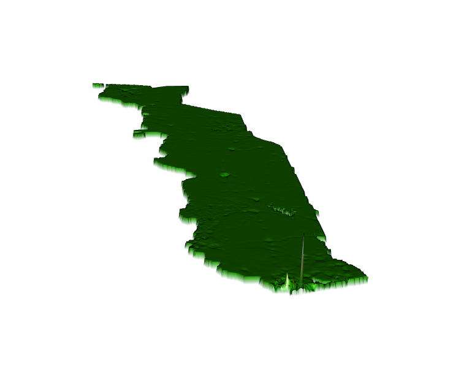

## Population Log

##### Population: Response- Log of Population
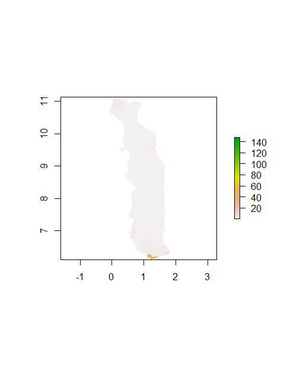
##### Difference: Response- Log of Population
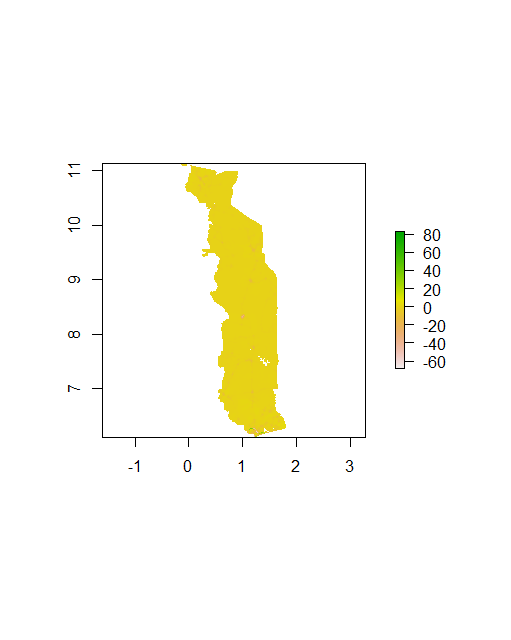
##### 3D Difference: Response- Log of Population
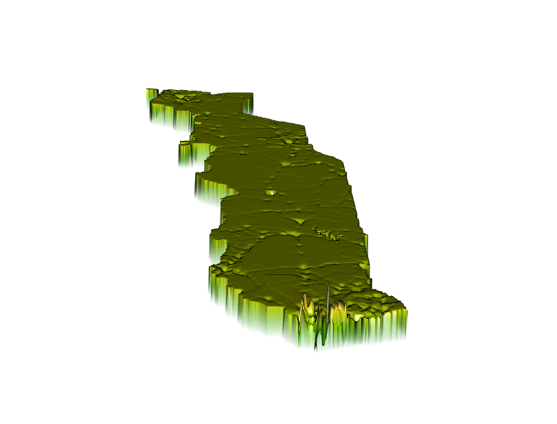

## Analysis: Which of the Three Produces the Best Result

My most accurate model is my population log. After running the `cellStats` function for the absolute value of every diff plot e.g. cellStats(abs(diff_sums), sum) the values that the console returned helped me determine which model had the least error. Diff_sums had 4,310,961; Diff_means had 5,115,725; and Diff_logpop had 4,255,246. So, by a difference of 55,715, the log of the population had the least error.

## De Facto Location of Human Settlements and Urban Areas, Roadways, and Location of Health Care Facilities

  The total population of my region, according to HDX, is 189,613. This includes Kéran and Doufelgou. In addition, there are 5 confirmed human settlements. There are technically more, but they are reasoned to be villages with small populations. As such, the settlements with 30,000 people increase the density factor when searching for urban areas.
  
  Because the densities and sizes of settlements in Kéran are smaller compared to those in Doufelgou, the only "urban" areas are in Doufelgou. There appears to be a densely populated region in the center of the largest urban area. This is also where the Niamtougou Airport resides. In addition, the location of the urban areas seems to correlate with the geographical location, i.e. each of the areas are in the proximity of rivers.
  
  There is one main highway that breaks the two regions in half. From that, secondary and tertiary roads break off, leading to buildings and towns. Although not depicted, there are many more roads in the country. I didn’t plot them because they were “unclassified” roads. The transportation network is actually quite complex when I plotted all of the roads. From the secondary and tertiary, many more tiny paths grew like tree branches to new villages. Overall, I believe there are plenty of roads that can give easy access for people to travel to their destination efficiently, although they may be dirt roads.
  
  Now, for health care facilities, I found that there really is only one hospital in the range of the whole region I chose. At first, I thought this was a mistake and tried to re-filter, however, both HDX and the plots confirm it. For this large area of land and amount of people, hospitals are in great need, especially clinics and doctors. 

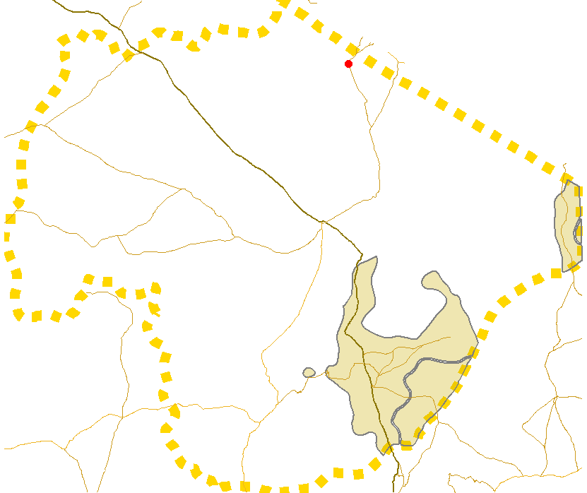

## De Facto Boundaries of Urban Areas, Roadways, Location of Health Care Facilities in a Three-Dimensional, Topographic Plot

  The human settlements appear to be centered on the Southeastern region past the mountains. The population also seems to be split by the mountains, with the majority of the settlements at the base of the mountain and around the river. Because of the mountain line right through the prefecture, only 2 roads lead into the hilly areas. So, the residents of Togo chose one side of the mountains to reside on since the travel distance to and from will be hindered by the mountains. 
  
  I do not believe that the topography has affected the location of the health care facility. In fact, there is not enough data to infer anything, as there is only one hospital within the two prefectures. Some health care issues include but are not limited to: the abscense of hospitals, doctors, and clinics. 
  
  Producing the three-dimensional map has resulted in a slightly different interpretation of the settlements and roadways. With only a two-dimensional plot, one would not be able to see the mountain line that cuts the lower prefecture in half. 
  
 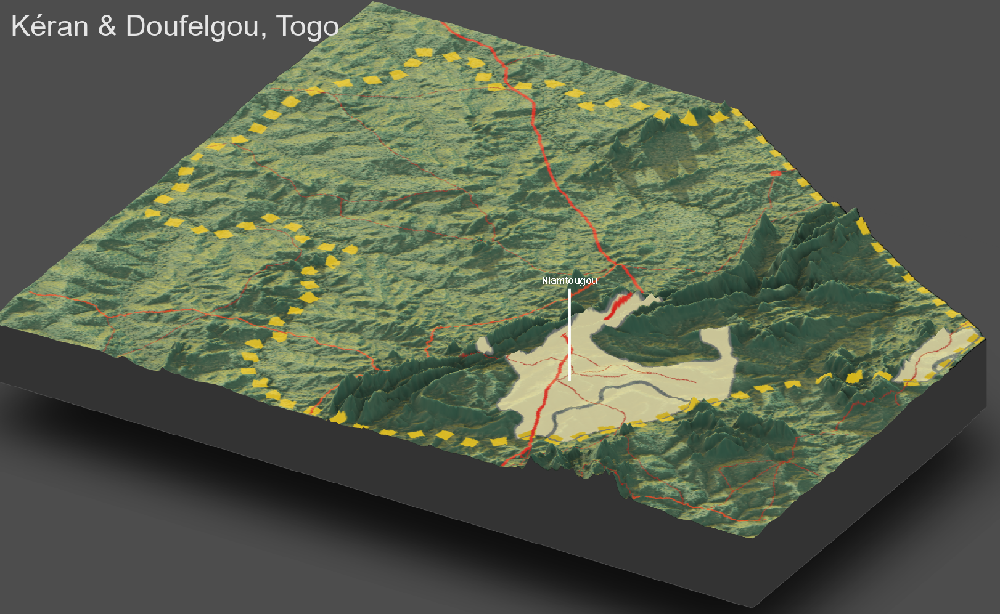
 
## Human Settlements and Urban Areas, Roadways, and Health Care Facilities Data in Kéran & Doufelgou, Togo

| Urban Population / Total Population | Roadway Networks                               | Health Care Facilities (Avg Pop/Facility) |
|:-----------------------------------:|:----------------------------------------------:|:-----------------------------------------:|
|33,800/189,613 people                |Total length: 49,647,729 m                      |189,613 people/ 1 hospital                 |
|                                     |# of Primary Roads: 18; total length: 88,707 m  |= 189,613 people per hospital              |
|                                     |# of Secondary Roads: 29; total length: 94,304 m|                                           |
|                                     |# of Tertiary Roads: 119; total length: 37,555 m|                                           |

## State of Human Development Assessment 

To start off, there need to be more urban, developed areas for people to settle in. There are practically zero urban areas in the northern areas of Kéran, but that doesn't mean people don't live there. The villages are just so small that their population could never compare to the size of a developed city. Next, although the total length of roads is almost 50 million meters, or 50,000 km, there aren't enough paved roads. The total length includes every road, including dirt roads. In fact, the only paved roads are the primary and secondary roads. Lastly, the state of health care in Togo is critical. There is a distinct lack of clinics, which will lead to many unnecessary deaths. Further, the hospitals must improve their technology as it is very behind developed countries. In conclusion, Togo requires improvements with its unpaved roadway networks and their lack/quality of health care.
